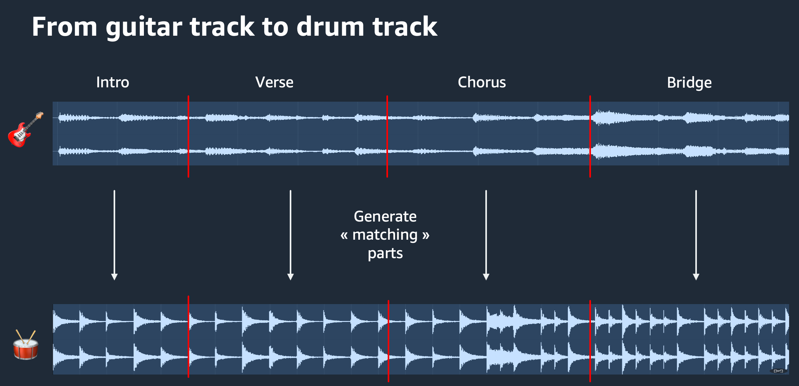
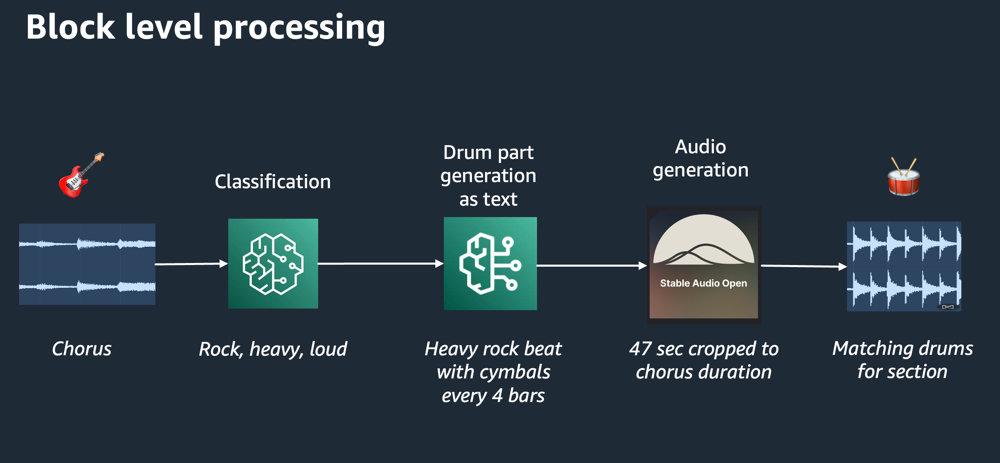
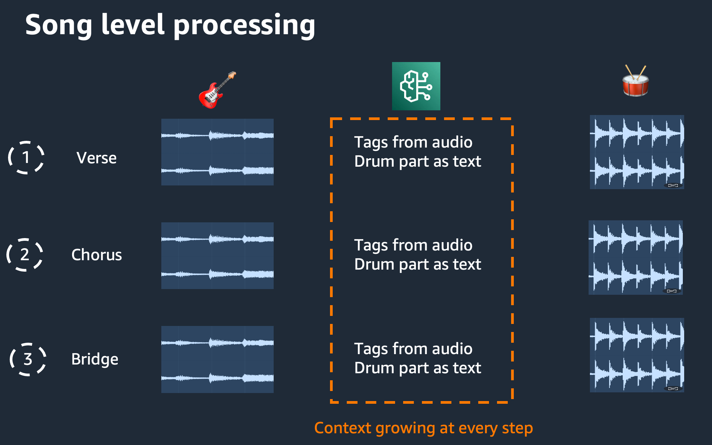

# AI Drummer from a guitar track

AI-powered drum track generator that complements music performances. It analyzes audio input and generates appropriate drum tracks using machine learning models.

It uses Claude 3.5 Sonnet for prompt generation and Stable Audio for audio generation.

## Features

- Analyzes input audio to extract musical characteristics
- Generates contextually appropriate drum prompts using Claude on Amazon Bedrock
- Creates drum "parts" using the Stable Audio model then stitches everything together
- Supports custom tempo and bar settings

## Process







# Samples

Check sample-generation folder for samples of inputs and outputs.

## Requirements, Work in progress

This is a pet project and requirements.txt is work in progress. 

Key requirements include:

- Python 3.x
- PyDub
- NumPy
- ONNX Runtime
- PyTorch
- Boto3 (for AWS Bedrock)
- Hugging Face Hub

## Setup

1. Install the required dependencies:
   ```
   pip install -r requirements.txt
   ```

2. Ensure you have the necessary AI models and credentials:
   - ONNX model for audio classification
   - Stable Audio model
   - AWS Bedrock credentials for Claude AI

## Usage

Run the main script `generate_drum_track.py` with the following options:

```
python generate_drum_track.py --input_audio <path_to_input_audio> --output_audio <path_to_output_audio> --tempo <tempo_value> --bars <bar_count>
```

## Parameters 

- `input`: Path to the input audio file, mp3 file, default is input.mp3
- `output`: Path to save the generated drum track, wav format, default is output.wav
- `tempo`: Desired tempo for the drum track (in beats per minute), default is 120
- `bars`: Number of bars for each analysis, default is 4. A corresponding drum track will be generated for each set of bars and stitched together at the end

### Example

```
python generate_drum_track.py --input input.mp3 --tempo 120 --bars 4
```

# Limitations

- This is a pet project, code is provided as is, no warranties
- This has been tested only on my macbook pro M1 Pro with 32GB of RAM, each block of bar takes around 1min to be generated
- The quality of the generated drum track depends on the input audio quality and the tempo and bar settings. Make sure the tempo of the original track is aligned with the value you provide
- Blocks are processed from sample 0 so your input file must start without any silence
- Only 4/4 time signature is supported for now
- Stable Audio is known to generate better results with some tempos like 60, 80, 100. This is believed to be due to the model being trained on these tempos.

## Todo

- [ ] Add a license
- [ ] Cleanup requirements.txt

